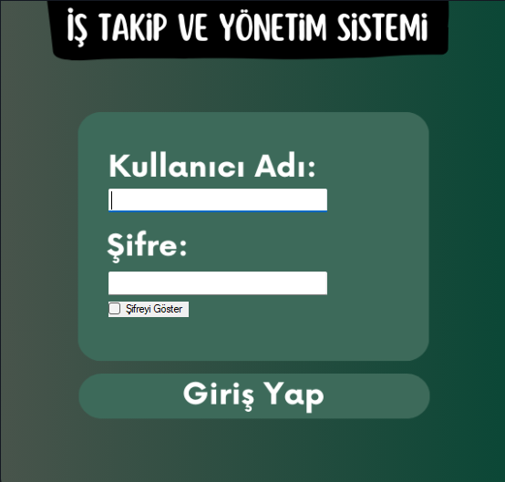
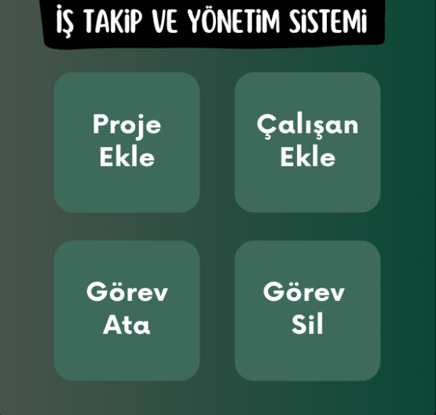
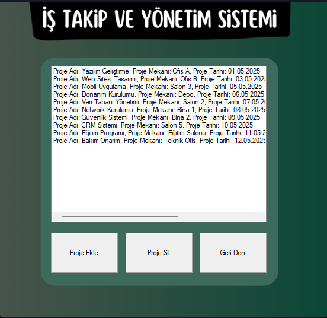
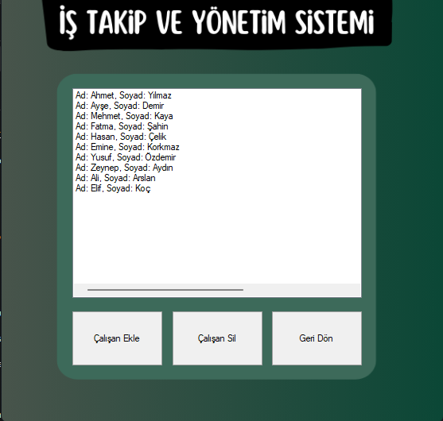
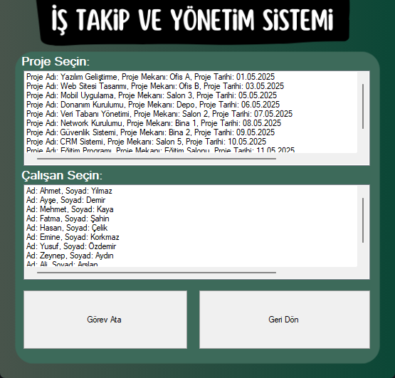
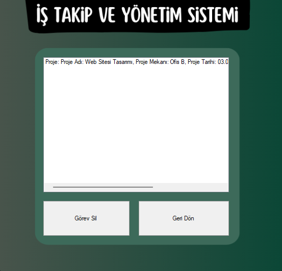

# 📋 İş Takip ve Yönetim Sistemi

Bu proje, **C# Windows Forms** kullanılarak geliştirilmiş bir **İş Takip ve Yönetim Sistemi** uygulamasıdır. Kullanıcılar, yapılacak işleri listeleyebilir, yeni görevler ekleyebilir, görevlerin durumunu güncelleyebilir ve tamamlanan işleri takip edebilir. Proje eğitim amaçlıdır.

## 🧩 Özellikler

- Görev ekleme, silme ve güncelleme
- Görevlerin tamamlanma durumunu izleme
- Günlük iş planı oluşturma
- Tamamlanan işleri görüntüleme
- Basit ve kullanıcı dostu arayüz

## 🛠️ Kullanılan Teknolojiler

- C# (Windows Forms)
- .NET Framework
- Visual Studio
- (Opsiyonel: JSON, XML ya da SQL Server ile veri saklama)

## 🖼️ Uygulama İçi Ekran Görüntüleri

  
  
  
  
  

